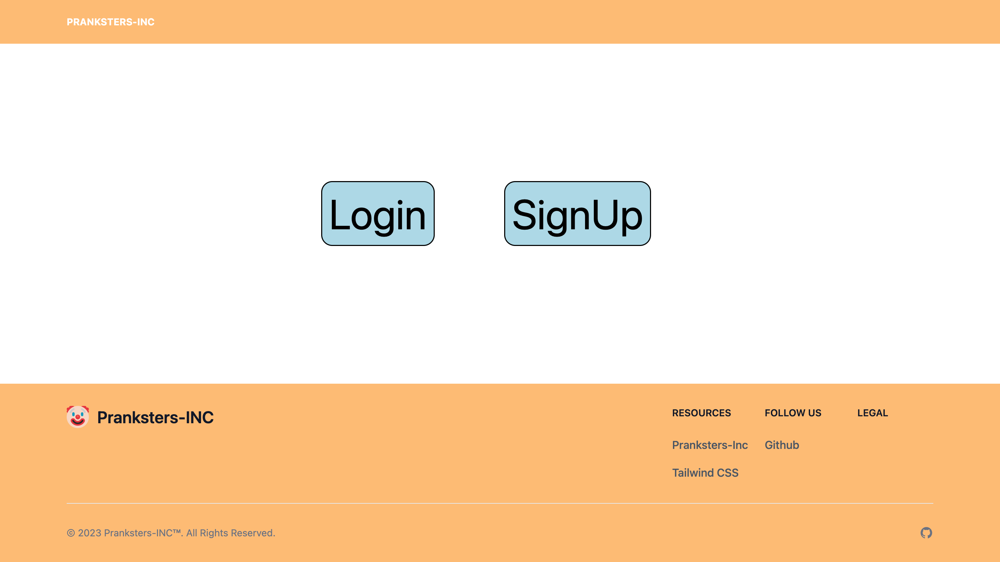
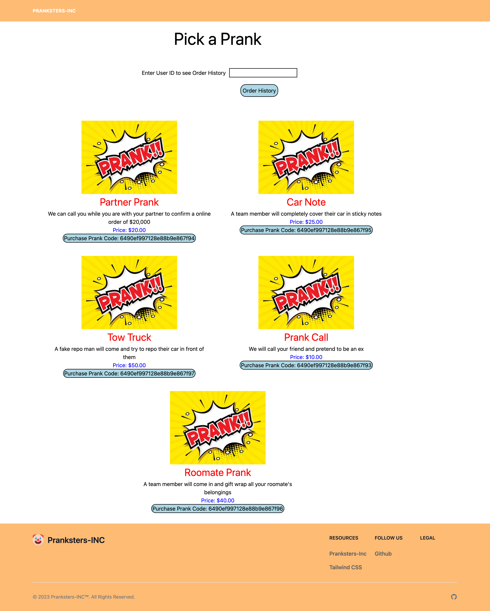

# Pranksters-Inc
 
  

  ## Table of Contents
  * [Description](#description)
  * [Installation](#installation)
  * [Usage](#usage)
  * [Contribution](#contribution)
  * [Test](#test)
  * [Questions](#questions)  
  * [License](#license)

  ## Description
  PRANKSTERS-INC is a website that allows users to browse and order pranks!

## Installation
- Run npm i
- Run npm run dev (look at scripts)

   ### Backend
   - express
   - apollo/server
   - jsonwebtoken(?)
   - graphql
   - mongoose
   - bcrypt

   ### Client
   - Login (JWT)
   - Apollo/client
   - React-router (static ~6.11.1)
   - context-api
   - tailwindcss
   - jwt-decode

## Usage
  When you first land on the webpage, you will be greeted by a homepage with options to login or sign-up. Once you've loged in or signed up you will be directed to the page with all the avalible pranks. You are able to submit a order and also view order history.
   
   
  This application can be used when you would like to order a prank to prank a peer.

 

## Contribution
  General Scope of duties:
#### Will Putnam
- Order-Form
- Login/SignUp
- Styling
- Seeds/Testing

#### Jennifer Jimenez
- Order-Form
- Models
- Styling
- Pranks Page

#### Kyle Moellenkamp
- OrderList
- Queries/Mutations
- Stripe
- Schemas

#### Jack Burke
- Models
- Login/SignUp
- Styling
- OrderList

#### Branham Morris
- ReadMe
- Queries
- Stripe
- Schemas

## Test
  Test Data for website:

     Id:
     username: DinoSpumoni
     email: dinocats@gmail.com
     password: password

      Id:
     username: prankdaddy
     email: merrypranks@gmail.com
     password: password

      Id:
     username: TomBombadill
     email: lotrfan33@gmail.com
     password: password

      Id:
     username: ICanCode
     email: htmlmaster@gmail.com
     password: password

## Questions
  * Will Putnam - https://github.com/Will-rd
  * Jennifer Jimenez - https://github.com/JJennifer
  * Jack Burke - https://github.com/JackBurke7 
  * Kyle Moellenkamp - https://github.com/kylemoely
  * Branham Morris - https://github.com/BranhamMorris
  

## License
  
    MIT License

## Deployed Application

  [Pranksters-Inc](https://boiling-beyond-75815.herokuapp.com/)

  

  

 